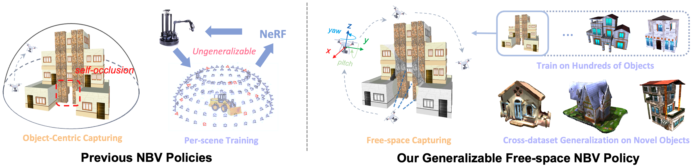
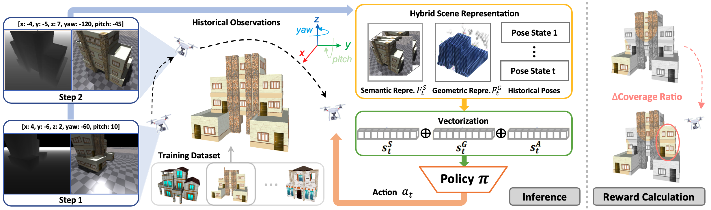
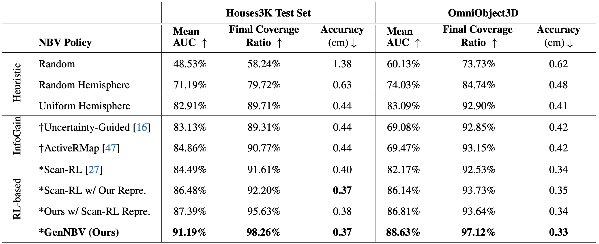

<br>
<p align="center">
<h1 align="center"><strong>GenNBV: Generalizable Next-Best-View Policy for Active 3D Reconstruction</strong></h1>
  <p align="center">
  	<strong>CVPR 2024</strong>
	<br>
    <a href='https://xiao-chen.tech/' target='_blank'>Xiao Chen</a>&emsp;
	<a href='https://quanyili.github.io/' target='_blank'>Quanyi Li</a>&emsp;
	<a href='https://tai-wang.github.io/' target='_blank'>Tai Wang</a>&emsp;
    <a href='https://tianfan.info/' target='_blank'>Tianfan Xue</a>&emsp;
	<a href='https://oceanpang.github.io/' target='_blank'>Jiangmiao Pang</a>&emsp;
    <br>
    Shanghai AI Laboratory&emsp;The Chinese University of Hong Kong
    <br>
  </p>
</p>


<div id="top" align="center">

[](https://arxiv.org/abs/2402.16174)
[](./assets/2024_CVPR_GenNBV.pdf)
[](https://gennbv.tech/)

</div>

> [!TIP]
> Our follow-up work for generalizable indoor active mapping can be found in https://github.com/zjwzcx/GLEAM.


## 📋 Contents
1. [About](#-about)
2. [Getting Started](#-getting-started)
3. [Model and Benchmark](#-Model-and-Benchmark)
4. [Citation](#-citation)
5. [License](#-license)


## 🏠 About
<!--  -->

<div style="text-align: center;">
    
</div>
While recent advances in neural radiance field enable realistic digitization for large-scale scenes, the image-capturing process is still time-consuming and labor-intensive. Previous works attempt to automate this process using the Next-Best-View (NBV) policy for active 3D reconstruction. However, the existing NBV policies heavily rely on hand-crafted criteria, limited action space, or per-scene optimized representations. These constraints limit their cross-dataset generalizability. To overcome them, we propose <b>GenNBV</b>, an end-to-end generalizable NBV policy. Our policy adopts a reinforcement learning (RL)-based framework and extends typical limited action space to 5D free space. It empowers our agent drone to scan from any viewpoint, and even interact with unseen geometries during training. To boost the cross-dataset generalizability, we also propose a novel multi-source state embedding, including geometric, semantic, and action representations. We establish a benchmark using the Isaac Gym simulator with the Houses3K and OmniObject3D datasets to evaluate this NBV policy. Experiments demonstrate that our policy achieves a 98.26% and 97.12% coverage ratio on unseen building-scale objects from these datasets, respectively, outperforming prior solutions.


## 📚 Getting Started
### Installation

We test our codes under the following environment:

- Ubuntu 20.04
- NVIDIA Driver: 545.29.02
- CUDA 11.3
- Python 3.8.12
- PyTorch 1.11.0+cu113
<!-- - PyTorch3D 0.7.5 -->

1. Clone this repository.

```bash
git clone https://github.com/zjwzcx/GenNBV
cd GenNBV
```

2. Create an environment and install PyTorch.

```bash
conda create -n gennbv python=3.8 -y
conda activate gennbv
pip install torch==1.11.0+cu113 torchvision==0.12.0+cu113 torchaudio==0.11.0 --extra-index-url https://download.pytorch.org/whl/cu113
```

3. NVIDIA Isaac Gym Installation: https://developer.nvidia.com/isaac-gym/download
```
cd isaacgym/python
pip install -e .
```

4. Install GenNBV.

```
pip install -r requirements.txt
pip install -e .
```

### Data Preparation

<!-- Please refer to the [guide](data/README.md) for downloading and organization. -->
We provide all the preprocessed data used in our work, including mesh files and ground-truth surface points. We recommend users download the data from our provided Google Drive link [[HERE](https://drive.google.com/drive/folders/1SUcDy8hwluEBpTtKZ3_83ySKnLlsZ4hi?usp=sharing)].

The directory structure should be as follows.

```
gennbv
├── active_reconstruction
├── data_gennbv
│   ├── houses3k
│   │   ├── gt
│   │   ├── obj
│   │   ├── urdf
│   ├── omniobject3d
│   ├── ...
```

### Training

Please run the following command to reproduce the training setting of GenNBV:

```
python active_reconstruction/train/train_gennbv_houses3k.py --sim_device=cuda:0 --num_envs=256 --stop_wandb --headless
```

[Weights & Bias](https://wandb.ai/site/) (wandb) is highly recommended for analyzing the training logs. If you want to use wandb in our codebase, please paste your wandb API key into `wandb_utils/wandb_api_key_file.txt`. And then you need to run the following command to launch training:

```
python active_reconstruction/train/train_gennbv_houses3k.py --sim_device=cuda:0 --num_envs=256 --headless
```

### Customized Training Environments

If you want to customize a novel training environment, you need to create your environment and configuration files in `active_reconstruction/env` and then define the task in `active_reconstruction/__init__.py`.


### Evaluation

Please run the following command to evaluate the generalization performance of GenNBV.

**Houses3K** (50 unseen houses from batch 12)

```
python active_reconstruction/eval/eval_gennbv_houses3k.py --sim_device=cuda:0 --num_envs=50 --stop_wandb=True
```


## 📝 TODO List
- \[x\] Release the paper and training code.
- \[x\] Release preprocessed dataset.
- \[x\] Release the evaluation scripts.

## 📦 Model and Benchmark
### Model Overview

<p align="center">
  
</p>

### Benchmark Overview

<p align="center">
  
</p>


## 🔗 Citation
If you find our work helpful, please cite it:

```bibtex
@inproceedings{chen2024gennbv,
  title={GenNBV: Generalizable Next-Best-View Policy for Active 3D Reconstruction},
  author={Chen, Xiao and Li, Quanyi and Wang, Tai and Xue, Tianfan and Pang, Jiangmiao},
  year={2024}
  booktitle={IEEE Conference on Computer Vision and Pattern Recognition (CVPR)},
}
```

If you use the preprocessed dataset such as Houses3K and OmniObject3D, please cite them:
```bibtex
@inproceedings{peralta2020next,
  title={Next-best view policy for 3d reconstruction},
  author={Peralta, Daryl and Casimiro, Joel and Nilles, Aldrin Michael and Aguilar, Justine Aletta and Atienza, Rowel and Cajote, Rhandley},
  booktitle={Computer Vision--ECCV 2020 Workshops: Glasgow, UK, August 23--28, 2020, Proceedings, Part IV 16},
  pages={558--573},
  year={2020},
  organization={Springer}
}
```
```bibtex
@inproceedings{wu2023omniobject3d,
  title={Omniobject3d: Large-vocabulary 3d object dataset for realistic perception, reconstruction and generation},
  author={Wu, Tong and Zhang, Jiarui and Fu, Xiao and Wang, Yuxin and Ren, Jiawei and Pan, Liang and Wu, Wayne and Yang, Lei and Wang, Jiaqi and Qian, Chen and others},
  booktitle={Proceedings of the IEEE/CVF Conference on Computer Vision and Pattern Recognition},
  pages={803--814},
  year={2023}
}
```
We're very grateful to the codebase of Legged Gym (https://github.com/leggedrobotics/legged_gym).

## 📄 License
<a rel="license" href="http://creativecommons.org/licenses/by-nc-sa/4.0/"></a>
<br />
This work is under the <a rel="license" href="http://creativecommons.org/licenses/by-nc-sa/4.0/">Creative Commons Attribution-NonCommercial-ShareAlike 4.0 International License</a>.
